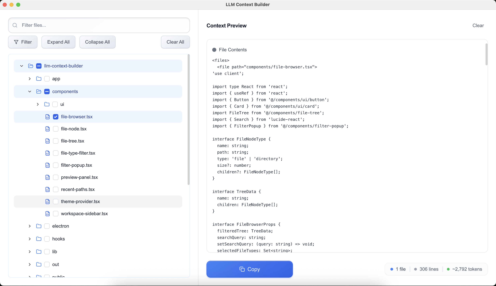

# LLM Context Builder

A powerful desktop app for preparing, previewing, and packaging any local codebase for large-language-model conversations. Built with Electron for native file system access and zero configuration.



> **TL;DR** – Pick a project folder, select files using an intuitive tree interface, and copy a perfectly formatted XML snippet—ready for ChatGPT, Claude, or any LLM.

**🖥️ NATIVE DESKTOP APP** – Gitignore-aware, keyboard-friendly, beautifully responsive, with deep macOS integration.

---

## Table of Contents

1. [Features](#features)
2. [Quick Start](#quick-start)
3. [macOS Launch Instructions](#macos-launch-instructions)
4. [Desktop Features](#desktop-features)
5. [Folder Structure](#folder-structure)
6. [UI/UX Details](#uiux-details)
7. [Tech Stack](#tech-stack)
8. [Building & Distribution](#building--distribution)
9. [Contributing](#contributing)
10. [License](#license)

---

## Features

| Area                      | Highlights                                                                                           |
| ------------------------- | ---------------------------------------------------------------------------------------------------- |
| **Native File Access**    | Browse directories using the OS file picker. No security restrictions. Remembers recent directories. |
| **Smart Tree Navigation** | Expandable tree view. Select folders to include all contents. Checkboxes propagate intelligently.    |
| **Gitignore Integration** | Respects `.gitignore`. Filters noise while preserving selections.                                    |
| **File Type Filtering**   | Filter by extension with visual indicators and keyboard control.                                     |
| **Live Preview**          | Syntax-highlighted XML preview with live updates, line counts, token estimates, and structure.       |
| **Menu Bar Integration**  | Native macOS menus: ⌘O to open, plus Edit/View/Window.                                               |
| **Clipboard Export**      | One-click copy of formatted XML, ready for LLM prompts.                                              |
| **Keyboard Shortcuts**    | Familiar shortcuts: ⌘O (open), ⌘F (search), ⌘C (copy).                                               |

---

## Quick Start

```bash
# Clone the repo
git clone https://github.com/your-org/llm-context-builder.git
cd llm-context-builder

# Install dependencies
npm install

# Start the app in development mode
npm run electron-dev
```

To build a distributable version:

```bash
npm run build-electron
```

---

## macOS Launch Instructions

The app is **not code-signed**, so macOS may block it at first launch. To allow it:

### First Launch

1. Locate the `.app` (e.g., `dist/mac/LLM Context Builder.app`).
2. Right-click the app in Finder and choose **Open**.
3. Confirm the dialog by clicking **Open**.

### After That

You can open it normally from Finder or Launchpad.

If you still have trouble:

```bash
xattr -d com.apple.quarantine "LLM Context Builder.app"
```

> ⚠️ The app requests no sensitive permissions. It only accesses files you select.

---

## Desktop Features

### File System Access

- OS-native folder picker
- No browser sandbox limitations
- Recents tracked and editable

### macOS Native Integration

- File/Edit/View/Window menus
- Keyboard shortcuts (⌘O, ⌘F, etc.)
- Dock icon with live state

### File Tree

- Expand/collapse folders
- Folder-level select-all
- Keyboard accessible

### Preview

- Instant XML output
- Syntax highlighting
- Token and line estimates

---

## Folder Structure

```
electron/               → Electron main process
  main.js              → App entry
  preload.js           → Secure IPC bridge

app/                   → Next.js frontend
  page.tsx             → Main UI
  globals.css          → Tailwind styles

components/            → React components
  file-tree.tsx        → Tree navigation
  filter-popup.tsx     → File filtering
  recent-paths.tsx     → Recent projects

hooks/                 → Custom hooks
  use-file-operations.tsx → File system logic

lib/                   → Utilities
  utils.ts             → Filtering logic
  file-types.ts        → File type detection
  recent-paths.ts      → Recents storage

public/                → Static assets
  logo.png             → App icon
```

---

## Tech Stack

| Layer         | Stack                              |
| ------------- | ---------------------------------- |
| Desktop Shell | Electron 37                        |
| Frontend      | Next.js 15 + React 19 + TypeScript |
| Styling       | Tailwind CSS                       |
| UI Components | shadcn/ui + Radix UI               |
| Icons         | Lucide React                       |
| File Access   | Node.js `fs` via Electron          |

---

## Building & Distribution

```bash
# Dev mode
npm run electron-dev

# Build Next.js app
npm run build

# Run Electron manually
npm run electron
```

### Production Builds

```bash
npm run build-electron    # Current platform
npm run dist              # All platforms (requires setup)
```

Tested on:

- ✅ macOS (primary)
- ⚠️ Windows/Linux (config present, untested)

> Code signing & auto-update are not included.

---

## Contributing

```bash
# Fork and clone
git clone https://github.com/your-username/llm-context-builder.git

# Install deps
npm install

# New feature branch
git checkout -b feature/your-feature
```

### Guidelines

- Use TypeScript strict mode
- Tailwind for styling
- Prettier + ESLint for formatting
- Follow structure and design system
- Test and document your changes

---

## License

[MIT](LICENSE) © 2025
